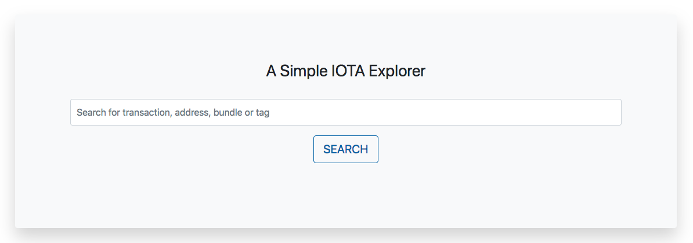

# pyota-flask
Pyota-flask is an open source IOTA Tangle explorer built with pyota and flask.



## Dependencies
Pyota-flask is compatible with Python 3.6 or higher.

## Running locally
Clone and set up Python environment:
```
$ git clone https://github.com/wusyong/pyota-flask.git
$ pipenv install --three
$ pipenv shell
```

Configure full node you choose to connect with and the secret key generate from flask-bcrypt in `config.py`. Then Run the server with following command:
```
$ export FLASK_APP=run.py
$ flask run
* Running on http://127.0.0.1:5000/
```
